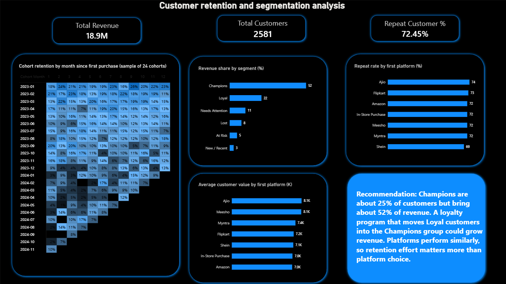
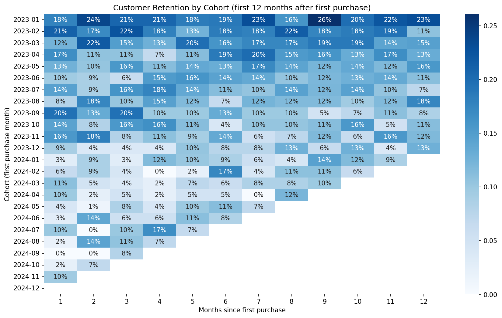

 Customer Retention & Segmentation Analysis (Python + Power BI)

An end to end analysis of 10,000 ecommerce orders from 2,581 customers. It answers three questions: which customers drive revenue and how well customers come back and whether the platform of the first order matters. The results are shown in a one page Power BI dashboard.



## Business Questions

1. Which customer segments bring in most of the revenue?
2. What share of each monthly cohort returns to buy again?
3. Do customers who first buy on one platform stay longer or spend more than others?

## Dataset

* **File:** `customer_shopping_behavior.csv` (source: add the link to the original page here)
* **Size:** 10,000 orders from 2,581 unique customers across 26 columns
* **Period:** 1 January 2023 to 31 December 2024
* **Contents:** customer ID, purchase date, purchase amount in ₹, city, category, platform, sale event, delivery details and return status

**Note:** The data appears to be synthetic. Values are spread very evenly and retention stays flat over time, which real retail data rarely does. The project demonstrates the method, so the findings should not be read as results from a real business.

## Tools Used

Python, Pandas, NumPy, Matplotlib, Seaborn, Jupyter Notebook and Power BI

## Approach

### 1. Data cleaning

* Rows before cleaning: 10,000
* Rows after cleaning: 10,000
* Invalid dates: 0
* Duplicate rows or transaction IDs: 0
* Missing values after cleaning: 0

The missing values were not errors. They had a meaning, so I kept the rows and added labels instead of dropping data:

* **Online Store** (2,249 blanks) became `In-Store Purchase` because these are offline orders
* **Delivery Speed** (2,249 blanks) became `N/A (Offline)` for the same reason
* **Festival/Sale** (6,788 blanks) became `No Sale` because no sale event applied
* **Size** (1,035 blanks) became `No Size` because the item has no size, such as an accessory

I also converted dates to a proper date type and trimmed extra spaces in text columns. Then I added four helper columns: `Order Month`, `Is Returned`, `Cohort Month` and `Months Since First`.

### 2. Cohort retention

Each customer is placed in a cohort based on the month of their first purchase. For each cohort I calculated the share of customers who ordered again in each following month. Months that have not happened yet are left blank instead of showing 0%. For example, the December 2024 cohort has no follow up months in the data.



### 3. RFM segmentation

Customers were scored from 1 to 5 on Recency (days since last order), Frequency (number of orders) and Monetary value (total spend). The scores were grouped into six segments: Champions, Loyal, Needs Attention, At Risk, Lost and New / Recent.

### 4. Platform comparison

Customers were grouped by the platform of their first order. For each group I compared the repeat rate (share with 2 or more orders), average orders and average customer value.

### 5. Dashboard

The Power BI dashboard has three KPI cards, the cohort retention matrix, a revenue share chart by segment, two platform charts and a recommendation box.

## Key Findings

* **72.45%** of customers placed 2 or more orders. The median customer placed 3 orders.
* **Champions are 638 customers (24.7%) but bring 51.9% of revenue.** Their average spend is ₹15,384, about 2.1 times the overall average of ₹7,322.
* **Champions and Loyal together are 40% of customers but bring 73.5% of revenue.**
* **Lost customers are 665 people (25.8%) but bring only 8.0% of revenue.**
* **Retention is flat.** In months 1 to 12, about 10% to 13% of a cohort orders in any given month (11.4% on average) with no sharp drop after month 1. A flat pattern like this is another sign of synthetic data.
* **Platforms perform similarly.** Repeat rates range from 69% to 74%. Average customer value ranges from ₹7,004 (Amazon) to ₹8,096 (Ajio).

### Segment summary

* **Champions:** 638 customers, 24.7% of customers, average spend ₹15,384, 51.9% of revenue
* **Loyal:** 394 customers, 15.3% of customers, average spend ₹10,374, 21.6% of revenue
* **Needs Attention:** 473 customers, 18.3% of customers, average spend ₹4,260, 10.7% of revenue
* **Lost:** 665 customers, 25.8% of customers, average spend ₹2,282, 8.0% of revenue
* **At Risk:** 200 customers, 7.7% of customers, average spend ₹4,752, 5.0% of revenue
* **New / Recent:** 211 customers, 8.2% of customers, average spend ₹2,433, 2.7% of revenue

Total revenue in the data is ₹1.89 crore (₹18,898,820).

## Recommendation

1. **Protect and grow the top segments.** A loyalty program that moves Loyal customers into the Champions group could grow revenue because Champions spend about twice the average.
2. **Run a reactivation campaign for At Risk customers.** They are 200 customers with an average spend of ₹4,752, which is higher than the Needs Attention and Lost segments.
3. **Do not prioritize by platform.** Platforms perform similarly, so retention effort matters more than platform choice.

These recommendations are illustrative because the data is synthetic.

## Limitations

* The dataset has no ad spend or acquisition channel, so marketing ROI and customer acquisition cost could not be calculated. "Platform" means where the customer placed their first order and not a marketing channel.
* The data appears synthetic, so patterns such as flat retention may not match real businesses.
* Cohort sizes range from 25 to 394 customers. The small 2024 cohorts give noisy percentages, so look at the overall pattern and not at single cells.
* Retention is measured as the share of a cohort that ordered in a given month. It is not a cumulative measure.
* The `Previous Purchases` column was not used because its values do not match the order counts in the file. Retention is built from order dates instead.
* The RFM cutoffs for the segments are my own choices and can be changed.

## Project Structure

```
Project folder
    Customer_Retention___Segmentation_Analysis.ipynb    Python analysis
    dashboard.pbix                                      Power BI dashboard
    customer_shopping_behavior.csv                      Raw dataset
    shopping_cleaned.csv                                Cleaned orders
    cohort_retention.csv                                Cohort retention table
    rfm_segments.csv                                    RFM scores per customer
    segment_summary.csv                                 Segment totals
    platform_comparison.csv                             Platform metrics
    retention_heatmap.png                               Retention heatmap
    Dashboard.png                                       Dashboard image
    README.md
```

## How to Run

1. Install the libraries with `pip install pandas numpy matplotlib seaborn jupyter`
2. Put `customer_shopping_behavior.csv` in the same folder as the notebook.
3. Open the notebook and update the file path in the first data loading cell if needed.
4. Run all cells. The exported CSV files and the heatmap image are saved in the same folder.
5. Open `dashboard.pbix` in Power BI Desktop to view the dashboard. The data is stored inside the file, so you can view it as it is. To refresh it, change the data source paths to your own folder under **Transform data** and then **Data source settings**.

## Author

**Nayan Deepak Borse**
B.E. Computer Engineering, aspiring Data Analyst
Add your LinkedIn or portfolio link here
